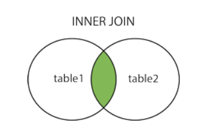
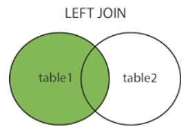
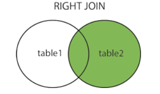

# Généralités et théorie
## Base de données **relationelles**
### S.G.B.D (MS-Access)
- Système de gestion de base de données
- Stockage de données
- Naviguer des données
- Partage de données
- Cohérence des données
- intégrité des relations
- Sécurité
---

### MS-ACCESS
- Avantage : 
  - Convivial
  - Rapide d'utilisation
- Désavantages : 
  - Limité en espace
  - Fonctionnalités limitées
---

### Objets :
- Tables
- Requêtes 
- Formulaire
- États (rapports)
- Modules (VBA)
---

### Relations :
- Clé primaire
- Clé étrangère
- Cardinalités
- Erreur d'intégrité référentielle
  - Supression en cascade
  - Modification en cascade
---

### Algèbre relationnelle
1. Identifier l'opérateur
   - Union
   - Intersection
   - Différence
   - Produit cartésien
   - Jointure interne
   - jointure externe
1. Effectuer l'opération
---

### SQL
- SELECT
  - INNER JOIN
  - DISTINCT
  - TOP

- Fonctions d'aggrégation (SUM(), AVG(), COUNT()...)
  - GROUP BY

- Jointure externe
  - LEFT JOIN
  - RIGHT JOIN \

- WHERE

